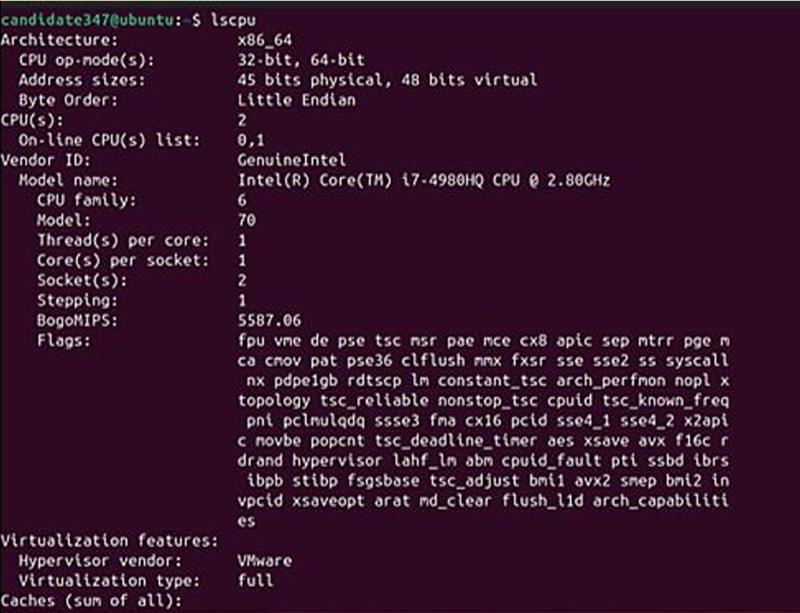

# Cloud Security Project (2024)

This project explores hybrid cloud architecture, compliance requirements, and hands-on security testing.  
It includes research, planning, and practical exercises using Azure, Nginx, Docker, and Apache Benchmark.

## Content

- Hybrid cloud architecture proposal  
- Security and compliance research (GDPR, NIS, US laws)  
- Security plan based on NIST CSF  
- Technical labs with DDoS simulation and containerized environments  

## Key Learnings

- Designing **hybrid cloud architectures** for scalability and compliance  
- Hands-on experience with **Nginx**, **Docker**, and **load testing**  
- Practical knowledge of **incident response** and **business continuity planning**  
- Using **Azure governance tools** to manage complexity  

## Tools and Technologies

- Microsoft Azure  
- Nginx  
- Docker  
- Apache Benchmark (`ab`)  
- Ubuntu VM  
- NIST CSF & CSA Cloud Security Guidance  

## Goal

To develop skills in cloud security design, governance, and technical testing through a realistic project scenario.

---

## Project Screenshots

### Virtual Machine Setup
I set up an Ubuntu virtual machine in VMware and verified the username using `whoami`.  
This ensures all screenshots are tied to my unique environment.

### CPU Info (lscpu)
To document the CPU architecture and performance, I ran the `lscpu` command inside the VM.  
This shows the number of CPUs, cores per socket, and the bogomips value for each core.

