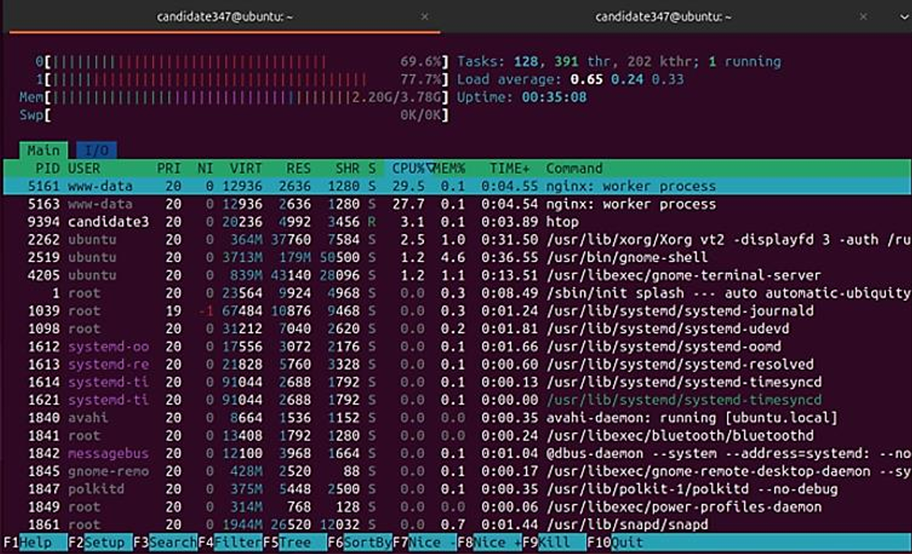
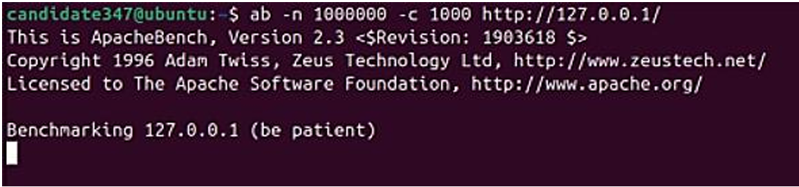
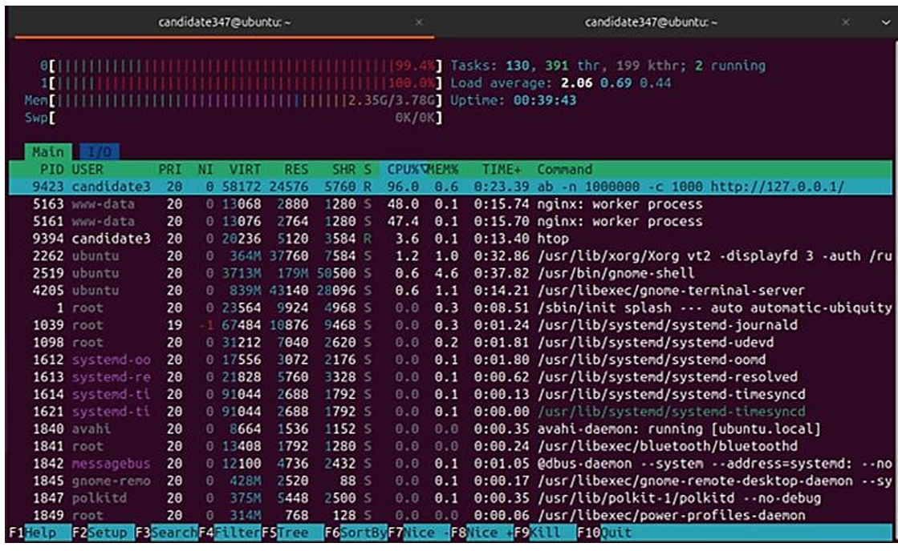
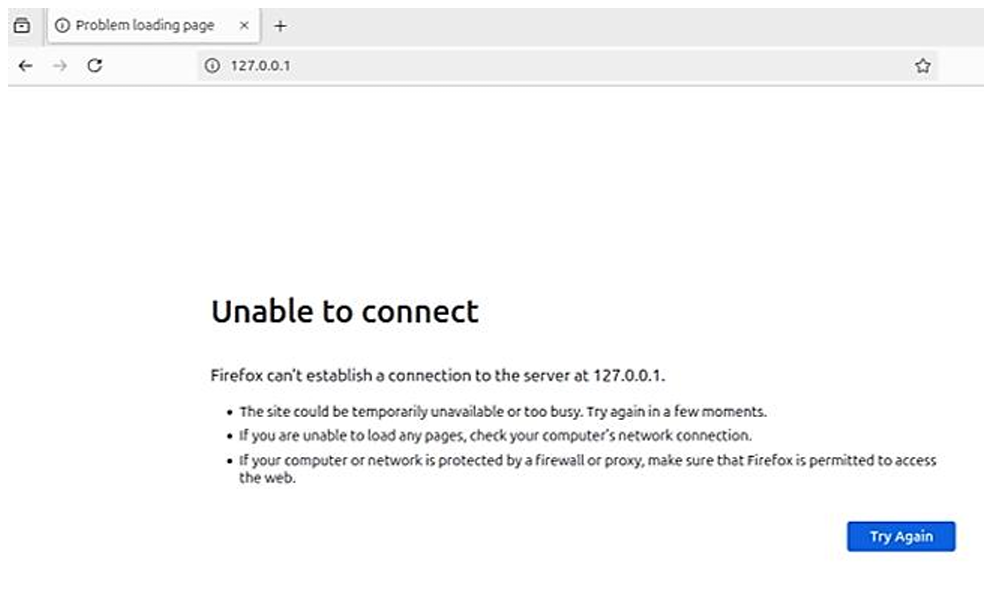

# Cloud Security Project (2024)

This project explores hybrid cloud architecture, compliance requirements, and hands-on security testing.  
It includes research, planning, and practical exercises using Azure, Nginx, Docker, and Apache Benchmark.

## Table of Contents

- [Content](#content)
- [Key Learnings](#key-learnings)
- [Tools and Technologies](#tools-and-technologies)
- [Goal](#goal)
- [Project Screenshots](#project-screenshots)
  - [Virtual Machine Setup](#virtual-machine-setup)
  - [CPU Info (lscpu)](#cpu-info-lscpu)
  - [Open Ports Check](#open-ports-check)
  - [ApacheBench DDoS Simulation](#apachebench-ddos-simulation)
  - [ApacheBench DDoS Simulation in Docker](#apachebench-ddos-simulation-in-docker)
  - [System Resource Usage During DDoS Simulation](#system-resource-usage-during-ddos-simulation)
  - [ApacheBench DDoS Stress Test (1,000,000 Requests)](#apachebench-ddos-stress-test-1000000-requests)
- [Conclusion & Future Work](#conclusion--future-work)

## Content

- Hybrid cloud architecture proposal  
- Security and compliance research (GDPR, NIS, US laws)  
- Security plan based on NIST CSF  
- Technical labs with DDoS simulation and containerized environments  

## Key Learnings

- Designing **hybrid cloud architectures** for scalability and compliance  
- Hands-on experience with **Nginx**, **Docker**, and **load testing**  
- Practical knowledge of **incident response** and **business continuity planning**  
- Using **Azure governance tools** to manage complexity  

## Tools and Technologies

- Microsoft Azure  
- Nginx  
- Docker  
- Apache Benchmark (`ab`) – load testing tool used to simulate concurrent requests  
- Ubuntu VM  
- NIST CSF & CSA Cloud Security Guidance  

## Goal

To develop skills in cloud security design, governance, and technical testing through a realistic project scenario.

---

## Project Screenshots

### Virtual Machine Setup

I set up an Ubuntu virtual machine in VMware and verified the username using `whoami`.  
This ensures all screenshots are tied to my unique environment.


### CPU Info (lscpu)

To document the CPU architecture and performance, I ran the `lscpu` command inside the VM.  
This shows the number of CPUs, cores per socket, and the bogomips value for each core.

**No of CPUs/Core:** 2  **BogoMIPS per core:** 5587.06


### Open Ports Check

To verify which network ports were open, I ran the `ss -tuln` command inside the VM.  
The output lists all listening ports, including protocol, local address, and process ID.

The command output shows that my system has open network ports, with both UDP and TCP sockets in the listening state.  
Notably, **port 631 is active**. The system is listening on:

- `0.0.0.0:631` (all IPv4 interfaces)
- `127.0.0.1:631` (local connections)
- `[::1]:631` (IPv6 loopback)

These ports are open and waiting for incoming connections, but there is no current data in the send or receive queues.


### ApacheBench DDoS Simulation

I installed **apache2-utils** and the **Nginx web server** on my Ubuntu virtual machine.  
I then performed a simulation of a Distributed Denial of Service (DDoS) attack using the `ab` (Apache Benchmark) command.

**Commands used:**

```bash
sudo apt update && sudo apt install nginx
sudo systemctl start nginx
ab -n 100000 -c 100 127.0.0.1
```

**Summary:**  
Simulated 100,000 HTTP requests with 100 concurrent connections against the local Nginx server to measure performance and observe CPU usage in real time.


### ApacheBench DDoS Simulation in Docker

Next, to run Nginx inside a Docker container, I pulled the Nginx image from Docker Hub and started a container with it using the command:

```bash
sudo docker run -d -p 80:80 --name nginx-container nginx
```

This command runs the Nginx container in detached mode (`-d`), maps port 80 of the host machine to port 80 of the container (`-p 80:80`), and names the container `nginx-container`.

Finally, in the same way as before, I used the `ab` command to simulate a DDoS attack — this time targeting the Docker container.

**Summary:**  
Simulated 10,000 HTTP requests with 100 concurrent connections against the Dockerized Nginx server to measure performance.


### System Resource Usage During DDoS Simulation

I observed the **CPU load**, **memory usage**, and **running processes** during the attack.  
This allowed me to compare the results of running Nginx directly on the virtual machine versus running it inside a Docker container.

**Observations:**

- **CPU Load:** The CPU load inside the Docker container was slightly lower than when running Nginx directly on the VM.  
- **Memory Usage:** The memory usage in the Docker container was also slightly different but still high due to the DDoS attack.  

**Result:**  
After running the DDoS attack inside the Docker container, I noticed that the CPU load and memory usage were slightly different compared to task B.3.  
The Docker container added some overhead, which slightly reduced the available system resources for Nginx.  
However, the system was still under significant load due to the high number of requests.

**Summary:**  
Visual representation of system performance (CPU and memory usage) during the ApacheBench DDoS simulation inside Docker.



### ApacheBench DDoS Stress Test (1,000,000 Requests)

For this task, I analyzed how many requests my virtual machine could handle before it went offline due to excessive load caused by a simulated DDoS attack.

**Command used:**

```bash
ab -n 1000000 -c 1000 http://127.0.0.1/
```

This command sends **1,000,000 requests** with **1,000 concurrent threads** to the Nginx server running on the virtual machine.



When I ran the command, the system load increased significantly.  
Using the `htop` command in another terminal window, I observed that the **CPU usage shot up to almost 100%** and the **memory usage was very high**.



After some time, the system became **unresponsive**, and the web server stopped responding to further requests.  
This indicates that the virtual machine had been overwhelmed by the excessive number of requests, effectively simulating a Distributed Denial of Service (DDoS) attack.



---

## Conclusion & Future Work

Through these experiments, I confirmed that running Nginx inside Docker introduces a slight overhead, but under moderate load performance remains largely acceptable.  
Under extreme load (1,000,000 requests), both the VM and containerized instances reached near‑maximum CPU and memory usage; eventually, the system became unresponsive.  
The Docker container’s isolation adds overhead that slightly reduces available system resources under stress.

### Key Takeaways

- Monitor CPU and memory usage under stress  
- Implement rate limiting or load balancing to prevent outages  
- Plan for capacity and scalability in real-world deployments  

### Future Work

- Automate benchmark tests using CI/CD pipelines for consistent, repeatable testing  
- Explore horizontal scaling using multiple containers or virtual machines  
- Introduce mitigation strategies such as caching, load balancers, or a Web Application Firewall (WAF)  
- Monitor additional performance metrics (network I/O, disk I/O, latency) to gain deeper insight  

---

_Project by Mahamed-Maki Saine — Cloud Security Project 2024_


