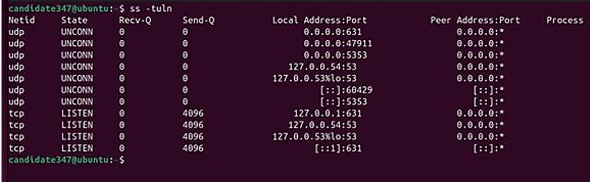

# Cloud Security Project (2024)

This project explores hybrid cloud architecture, compliance requirements, and hands-on security testing.  
It includes research, planning, and practical exercises using Azure, Nginx, Docker, and Apache Benchmark.

## Content

- Hybrid cloud architecture proposal  
- Security and compliance research (GDPR, NIS, US laws)  
- Security plan based on NIST CSF  
- Technical labs with DDoS simulation and containerized environments  

## Key Learnings

- Designing **hybrid cloud architectures** for scalability and compliance  
- Hands-on experience with **Nginx**, **Docker**, and **load testing**  
- Practical knowledge of **incident response** and **business continuity planning**  
- Using **Azure governance tools** to manage complexity  

## Tools and Technologies

- Microsoft Azure  
- Nginx  
- Docker  
- Apache Benchmark (`ab`)  
- Ubuntu VM  
- NIST CSF & CSA Cloud Security Guidance  

## Goal

To develop skills in cloud security design, governance, and technical testing through a realistic project scenario.

---

## Project Screenshots

### Virtual Machine Setup
I set up an Ubuntu virtual machine in VMware and verified the username using `whoami`.  
This ensures all screenshots are tied to my unique environment.


### CPU Info (lscpu)
To document the CPU architecture and performance, I ran the `lscpu` command inside the VM.  
This shows the number of CPUs, cores per socket, and the bogomips value for each core.

**No of CPUs/Core:** 2  **BogoMIPS per core:** 5587.06


### Open Ports Check

To verify which network ports were open, I ran the `ss -tuln` command inside the VM.  
The output lists all listening ports, including protocol, local address, and process ID.

The command output shows that my system has open network ports, with both UDP and TCP 
sockets in the listening state. Notably, **port 631 is active**.  
The system is listening on:

- `0.0.0.0:631` (all IPv4 interfaces)
- `127.0.0.1:631` (local connections)
- `[::1]:631` (IPv6 loopback)

These ports are open and waiting for incoming connections, but there is no current data in the send or receive queues.

  

### ApacheBench DDoS Simulation

I installed **apache2-utils** and the **Nginx web server** on my Ubuntu virtual machine.  
I then performed a simulation of a Distributed Denial of Service (DDoS) attack using the `ab` (Apache Benchmark) command.

**Commands used:**

```bash
sudo apt update && sudo apt install nginx
sudo systemctl start nginx
ab -n 100000 -c 100 127.0.0.1
```

**Summary:**  
Simulated 100,000 HTTP requests with 100 concurrent connections against the local Nginx server to measure performance and observe CPU usage in real time.


### ApacheBench DDoS Simulation in Docker

Next, to run Nginx inside a Docker container, I pulled the Nginx image from Docker Hub and started a container with it using the command:

```bash
sudo docker run -d -p 80:80 --name nginx-container nginx
```

This command runs the Nginx container in detached mode (`-d`), maps port 80 of the host machine to port 80 of the container (`-p 80:80`), and names the container `nginx-container`.

Finally, in the same way as before, I used the `ab` command to simulate a DDoS attack — this time targeting the Docker container.

**Summary:**  
Simulated 10,000 HTTP requests with 100 concurrent connections against the Dockerized Nginx server to measure performance.


